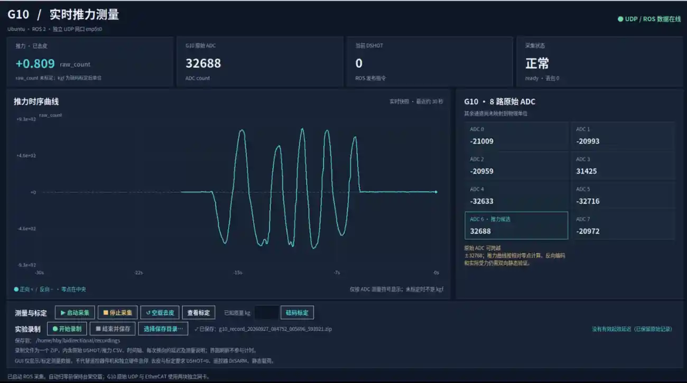

# G10 Linux 推力上位机

**Ubuntu 22.04 · ROS 2 Humble · G10 UDP + EtherCAT DSHOT**



不用 Windows 上位机，即可在 Ubuntu 桌面查看 G10 推力、正负推拉曲线、8 路 ADC 原始值、DSHOT 指令及通信状态；提供**空载去皮、已知砝码标定、实验录制、指令→推力响应延迟 ZIP 导出**。

> **适用范围**：本分支按已抓取的 G10 UDP 报文开发。ADC 6 暂按推力通道处理；其他 ADC 的物理含义及反向量程尚待验证。未标定时读数单位为 `raw_count`，**不是 kgf**。

## 1. 连接 G10

G10 网线接 Ubuntu 的**独立物理网卡**；EtherCAT 主站使用另一块网卡，二者不可混用。以下使用实验中的 `enp5s0`，请按实际网口名替换：

```bash
ip -br link
sudo ip link set enp5s0 up
sudo ip address replace 192.168.127.55/24 dev enp5s0
ip -br -4 addr show enp5s0
```

已验证的 G10 数据流为 `192.168.127.56:5000 → 192.168.127.55:4800/UDP`。配置不应覆盖 EtherCAT 网口，也无需更改系统默认网关。以上 IP 配置为临时配置，重启后可能需要重新设置。

## 2. 安装 ROS 包与桌面软件

前置条件：Ubuntu 22.04 已安装 **ROS 2 Humble**；可正常编译 `colcon` 工作空间；已具备项目使用的 `custom_msgs`（来自 [EcatV2_Master](https://github.com/AIMEtherCAT/EcatV2_Master)，可在同一个工作空间编译，或 source 已安装它的工作空间）。仅有本仓库、缺少 `custom_msgs` 时，ROS 节点无法编译。

```bash
sudo apt update
sudo apt install -y git python3-tk python3-colcon-common-extensions

# 新主机：将仓库放在工作空间根目录下，保持桌面脚本的路径约定
mkdir -p ~/bidirectional
git clone --branch g10-linux-udp \
  https://github.com/ssybh2/Bidirectional-Motor-Test.git \
  ~/bidirectional/Bidirectional-Motor-Test

# 如 custom_msgs 在另一个已编译的 ROS 工作空间，先 source 其 install/setup.bash
cd ~/bidirectional
source /opt/ros/humble/setup.bash
colcon build --symlink-install --packages-up-to bidirectional_motor_test

# 以普通用户注册 Ubuntu 桌面应用（不要用 sudo）
bash ~/bidirectional/Bidirectional-Motor-Test/scripts/install_g10_desktop.sh
```

已有本仓库时，无须重复 clone：在 `Bidirectional-Motor-Test` 下执行 `git switch g10-linux-udp && git pull --ff-only origin g10-linux-udp`，然后重新 `colcon build` 即可。

**桌面打开方式**：Ubuntu 应用列表搜索 **G10 推力测量**；也可运行 `bash ~/bidirectional/Bidirectional-Motor-Test/scripts/launch_g10_desktop.sh`。GUI 打开本身不需要先运行 ROS，但点击「启动采集」需要 ROS 环境及可用的 G10 UDP 流。

## 3. 启动与录制

1. **保持 ESC 动力断开、测试台空载**，关闭其他监听 UDP 4800 的程序；打开 GUI →「启动采集」→等待数据状态正常。
2. 空载静止后点击「空载去皮」；使用真实已知砝码时才能执行「砝码标定」（单位才会切换为 `kgf`）。可先轻推/轻拉验证正负曲线。
3. 在「实验录制」中**选择保存目录 → 开始录制 → 结束并保存**。默认写入 `~/bidirectional/recordings/` 下的 ZIP；内含 `command.csv`、`force.csv`、`timeline.csv`、`event_summary.csv`、`latency.csv` 和采集质量/说明文件。原始连续日志保存在 `~/bidirectional/measurements/`。
4. 如果需要实际 DSHOT 指令测试，**先另行启动并验证 EtherCAT 主站**；本 GUI 不会启动主站或替代硬件急停。配置中默认遥控器话题 `/ecat/sn2555957/app1/read`、DSHOT 话题 `/ecat/sn2555957/app2/write`，设备 SN 不同须先修改 [config/motor_test.yaml](config/motor_test.yaml) 并重新编译。原控制安全顺序为遥控器 **2 → 3 → 1**；带桨反转前仍需真实 RPM 停转联锁与独立断电急停。

**延迟含义**：报告的是 ROS DSHOT **发布时刻 → G10 估算的推力采样时刻**，不是硬件同步的纯电机延迟；G10 内部缓存、网络和调度误差仍需单独标定。没有有效推力响应时结果标记为未确定，不会写成 `0 ms`。

## 4. 检查与排错

```bash
# 没有 G10 数据：确认网卡、IP 和 UDP 报文
ip -br -4 addr show enp5s0
sudo tcpdump -ni enp5s0 'udp port 4800'

# 图标点击没反应：查看桌面启动日志
tail -n 80 "${XDG_STATE_HOME:-$HOME/.local/state}/bidirectional-g10/dashboard-launch.log"

# 只读 UDP 探针（必须先停止正在接收 UDP 的 ROS 节点）
cd ~/bidirectional/Bidirectional-Motor-Test
python3 -m bidirectional_motor_test.g10_probe \
  --bind 192.168.127.55 --seconds 10
```

如提示 `Permission denied` 无法编译，请检查以前是否用 root 生成了 `build/`、`install/`、`log/`；**不要用 sudo 执行 colcon 或启动 GUI**。

更多协议说明、静态标定、换向状态机与日志字段见 [详细技术文档](docs/DETAILED_GUIDE.md)。

## 5. root EtherCAT + 普通用户 G10 GUI（UDP 4800 冲突修复）

**一个 G10 测试台只能有一个 UDP 4800 采集者。** 本 GUI 只读取 CSV，绝不另外抢占 UDP。现在 `ros2 launch bidirectional_motor_test motor_test.launch.py` 会从 **bidirectional_motor_test 的 colcon 安装前缀**计算工作空间，因此 root 与普通用户运行时均使用：

- `<工作空间>/measurements/`（CSV 与实时 GUI）
- `<工作空间>/calibration/g10_channel6.json`（标定增益）

此规则会覆盖 YAML 中的 `~/...` 直接运行回退值；不依赖 root 的 `HOME`。如果工作空间为 `/home/hby/bidirectional`，启动日志应出现 `CSV=/home/hby/bidirectional/measurements/...`，而不是 `/root/bidirectional/measurements/...`。旧 root 目录中的历史记录不会自动迁移。

**推荐启动顺序（先断开 ESC 动力、拆桨检查）：**

```bash
# 终端 1：需要原始网卡权限的 EtherCAT 主站按既有方式启动
sudo -s
source /opt/ros/humble/setup.bash
source /home/hby/one/install/setup.bash
ros2 launch soem_bringup bringup.launch.py

# 终端 2：普通 hby 用户，先确认能收到 RC/DSHOT 话题
source /opt/ros/humble/setup.bash
source /home/hby/one/install/setup.bash
source /home/hby/bidirectional/install/setup.bash
ros2 topic echo /ecat/sn2555957/app1/read --once
ros2 launch bidirectional_motor_test motor_test.launch.py

# 终端 3：普通 hby 用户打开 GUI，不要再启第二个采集节点
bash /home/hby/bidirectional/Bidirectional-Motor-Test/scripts/launch_g10_desktop.sh
```

如果 Motor Test 确实必须以 root 运行，先确保 `/home/hby/bidirectional/measurements` 及 CSV **对 hby 可读**，标定目录也有合适的共享写权限。历史上由 root 建立的目录可能无法让普通用户创建新会话，务必停机后检查所有权；不要以 root 启动图形界面。正常情况下 DDS 消息订阅/发布本身不需要 root，两端仍须使用同一 ROS_DOMAIN_ID 与兼容的 RMW 环境。

GUI 在点击「启动采集」时，会立即扫描共享目录的 **command.csv 心跳**，即使 G10 正在归零或暂时无力数据，也会附着现有节点而不再次启动。若 UDP 已占用且找不到可读心跳，会明确提示检查 `CSV=` 路径与 `sudo ss -lunp | grep ':4800'`，不会尝试抢占端口。采集进程必须唯一：不要同时运行 g10_probe 或另一套绑定 4800 的厂商软件。

`ros2 run` **绕过了上述 launch 参数覆盖**；若直接运行，请显式指定绝对路径 `log_directory` 和 `g10_calibration_file`，避免再次遇到 root/普通用户 HOME 不一致。

Ctrl+C 后 ROS 2 可能先销毁 DDS 上下文，使最后的 DSHOT 0 **无法发出**。现在退出时会检测上下文、捕获发布异常并继续释放 UDP 与 CSV，但这只解决退出异常，**不构成物理急停，也不保证电机已停转**。请使用独立物理 ESC 动力切断及下位机失联清零措施。

